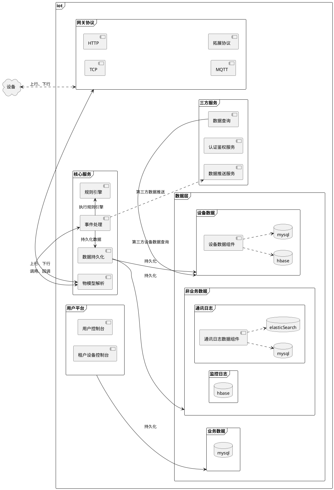
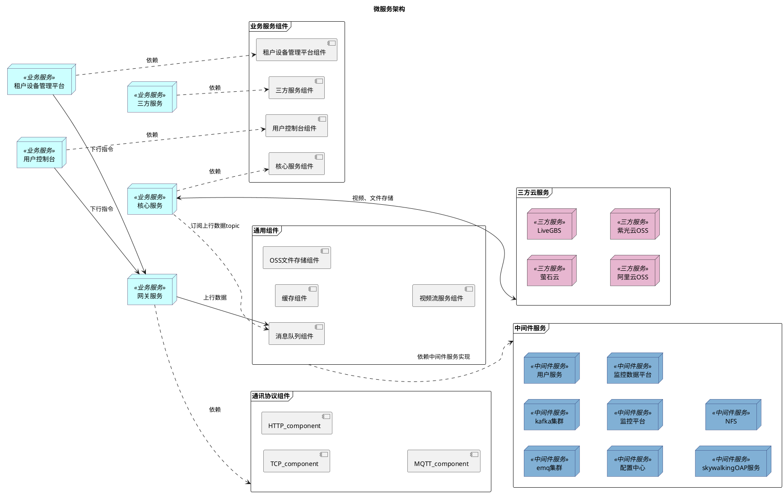
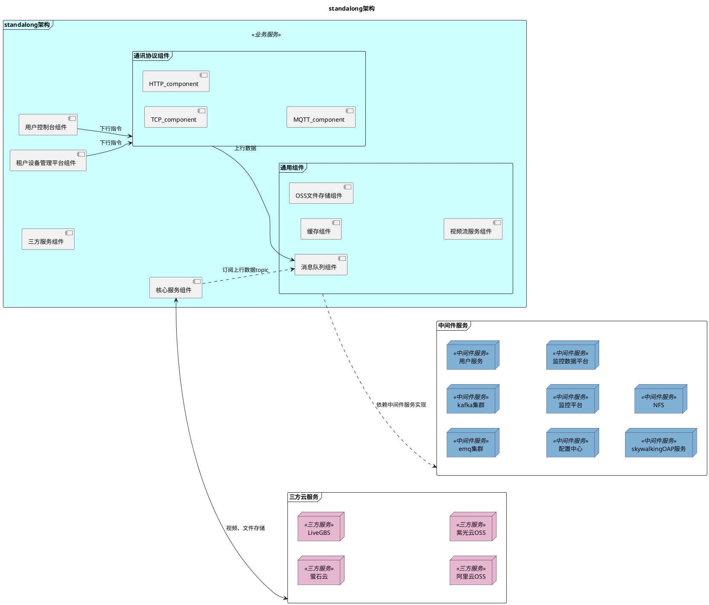

### 业务架构

================================================================
### 应用架构
#### 核心组件
● 通用服务组件
TODO
● 业务服务组件
TODO
● 通讯协议组件
TODO
#### 两种部署架构
● 微服务架构（16G内存）
● standalong架构（10G内存）
图 TODO
#### 微服务架构
![image](https://www.plantuml.com/plantuml/png/XPJVJZf75CUlV_iKa_HQWqgf6aC4rFQYBJPmRxOmu0ROfRjBZJ4csegY5PLQbMZLQaYqQLnDLQfIyM7A_jctw2mxCiDcG2wCS3xVSywSxyoPL5HULWkvB9U5AHMe4f25zBmAae8C4weWYHod2ceM0hsf6R-NzQqBuwnkdArnd98Hn3mlypcGGdyW04lSfp2VoAHbgI0c8r9MaYScx4R5QZxRfx_gBmV18FXiT2Zic_eSWPASX78FQDW_F1q8SptJcNzlOdBwYt1WoiTCHo2VtnVozKlNUCDao1U9108a7HFoZmoD-QTwfxFsJp4PYSoW3qd7X3vAP_nPnIGCZ0sDZ99qJ0YdMwRz4QKa14ki4gsdO-IewokZOpR4x1YJD_RHGwjH9p33S1R7zXp3cyRXCoOPdZCXxFaoXpxkzRHNZYtjLY_lMffcDjPGSR04KBs4bCjB8XHL48_CpdM-qO6lul4UaM--YyUf2Ag7gz4pUwz62uq_dlItdxlYl08IaWpfGhJ2_EtQAFrZx5pffRg-UqT41SMPWgX8sTxQgtEajRIcNjimjGjpRrr_lkzAmYTpWlX15dh6H1aD5THvIh9CJnmrtJbzLqF_xkitLJVKNIGQYnc76-Xd5DT_kcOXHhrahDxQrNEzTCIAMrVhzcN5U5obMsttrNu8vcj5BzwxCU2ztSw9qhmA5_X5W7bY5Ol7hc7MOn8Jf_p2AhOzR3bnYkXfOnWQx15uzyNp-jhMjFF0t0_soRhPh07M4-KL1vZxNfOoKEG-OKs6JsNutgesHoQ3A_O3xMBPVDLG70szVyQJ2XeqcHIhuRmivQ0w3mkAHsOSt1bbhRyuBVCfNkGxIYMpkC1dqLPDHqEpVKw2yMzdOgmmsH6kRQsNYjS7Qwzcdj-Z0F0iDdBuhuKVuPVXM6_0hhxP6zieHpJMXp8V_jABcomAT_h-5WO7WwmDEWvQpLFhyH1mpYDmACyEwn0SkVOkHxupSNpD2Kz-O0lSE-wGxVyO23dDm42GiKKSy6dBkjXsBmSv4XErj4kxMgG5gfGN4gvgmgdWzNSSRwR_LbRf5STrZSOHuZRR_VpYfDz6T8qQIN-EenUlSm3lY-zCnFExhfsPEtVS91IJXLpsVm00)

#### standalong架构

![image](https://www.plantuml.com/plantuml/png/dPHTJnfB6CUlcKynoRdMe78uQemHKC-vE2qsS6-sCE26POVkBcqQGwAjBsX5fLObMhKQ4cqQLrELghJuOUg-xBVeu4xeCjd5f5vi8i_l_vzddfSPaHLEKl9P0GWefK05GubFJoamoKieeV1O143X5G51meb9Ji1YMj-lwVjp0CWPNinn4fU5AV9144u3NvXBPD8Ipel921QmD3HarSjcuyRQUw_TRWuFmx_wUyB-qRy9YAKaaZoWta3lM30CFEsChqkK7Fid71prCtOiv0_uG_vETlKxIeRyaKWmoDenKA2lPo0mwcrdRknHCX8P9t-i7GCzPgT_hb0I1GTw-lfPEmQYTWK8d1qISHB1QRT3xgzFhUtB-tfD_rZIbWyzUyHmdcsYy9A-TKD9hpQn46rJWPqipyHtY93AlOhDGAtg060xirCDMSaq96VRh3MpOwfdMcdDL5MZFaTA0KdK1to-1Cxci8X41SOZ4vEj_zeY_yNZNg4dp-9nPmZu2kJZ0FHFrzhTMpibUZ8dmmIMa5FcL1WVJlJYDttrM2lMjBNptwAytAoDA6F1MtjyGBIcsj2gYuPwQAmlQ3SNRIPSCikBZxZGxZ8vHqDvPSeX0H2sYajofc2ptyw4lczefnKxHW9jiMWifcyjaW0Xj3Sdxf1UA-gpPrRbG2jkknFcyO9rLDQlPfq9apxOUqId1J8xy93dmsQXx0jhTy5eLA7Red1o4vXyBk4C4e6FQZ9SAiDvgreSRQLzOYVGcYyPFrGI9xFIsN6tJ2R3RgfNmZa9Pv4oXV8o8zCtp_MIsbcSbhWK9t8jfPnv_OeJo5Adew693ZUX-DFnc6kuq6g4FLptjsMs4UPwrJYu8078lY-jPFxdNw9_mp5lmAhSMOihn2CQwq0Pbr-q-IMMSgRgybvqTGsx32CS91TQDWzNxDg2ziM6tTqU8bCziYhpJgc2Sto2rGyrJsKhDaX7_kVCh7D_071z81uIP-z34t_NF7s5M5G1VHV-J0pQdW1oQNRTceB6ddcrnVokgVl6wZaOGM8odnL-0G00)

