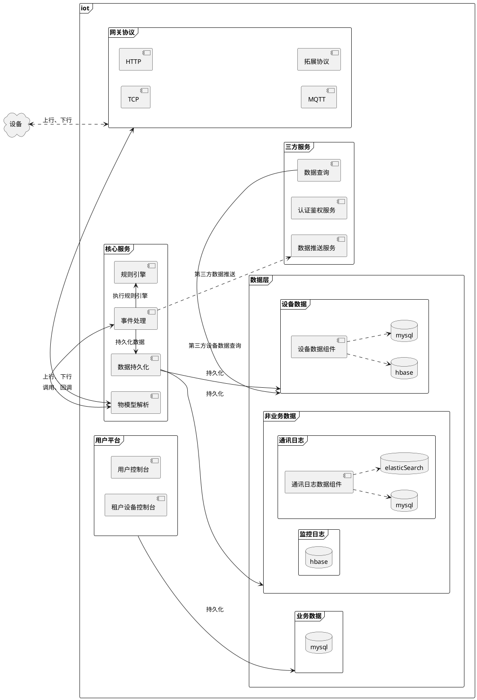

### 业务架构

```plantuml

@startuml

left to right direction


cloud 设备 as device 
frame iot {

	frame 网关协议 as  gateway {

		component TCP
		component HTTP
		component MQTT
		component 拓展协议 as extends

	}

	frame 核心服务 as core {

		[物模型解析] as thingModule
		[事件处理] as eventHandle 
	  [数据持久化] as persistence
		[规则引擎] as ruleEngine
	}

	frame 用户平台 {

		[用户控制台]
		[租户设备控制台]
	}

	frame 三方服务 {
		component 认证鉴权服务 as OAuth
		[数据查询] as 3tdDataQueryService
		[数据推送服务] as 3tdDataPushService
	}

	frame 数据层 as data {

		frame 业务数据 {
			database mysql as businessMysql
		}

		frame 设备数据 {
			component 设备数据组件 as deviceDataComponent
			database hbase as deviceHbase
			database mysql as deviceMysql
			
			deviceDataComponent ..> deviceHbase
			deviceDataComponent ..> deviceMysql
		}

		frame 非业务数据 {
			frame 通讯日志 {
				component 通讯日志数据组件 as deviceCommunityLogComponent
				database mysql as deviceCLMysql
				database elasticSearch

				deviceCommunityLogComponent ..> deviceCLMysql
				deviceCommunityLogComponent ..> elasticSearch
			}
			frame 监控日志 {
				database hbase as monitorHbase
			}
		}
	}

device <..> gateway : 上行、下行
gateway <-> thingModule : 上行、下行
thingModule <-> eventHandle : 调用、回调
eventHandle -> persistence : 持久化数据
eventHandle -> ruleEngine : 执行规则引擎
persistence -> 设备数据 : 持久化
persistence -> 非业务数据 : 持久化

用户平台 -> 业务数据 : 持久化
用户平台 -> thingModule : 下行指令

3tdDataQueryService -> 设备数据 : 第三方设备数据查询
eventHandle ..> 3tdDataPushService : 第三方数据推送

}


@enduml

```
================================================================
