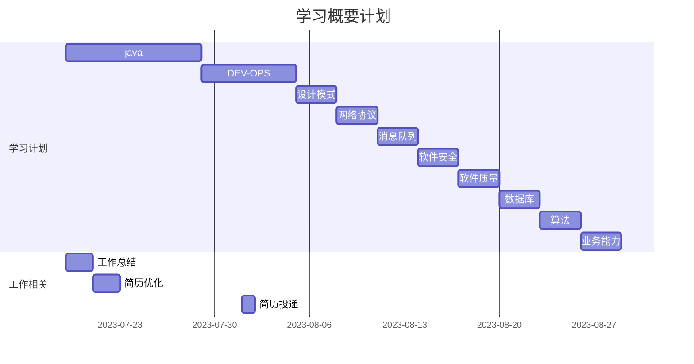
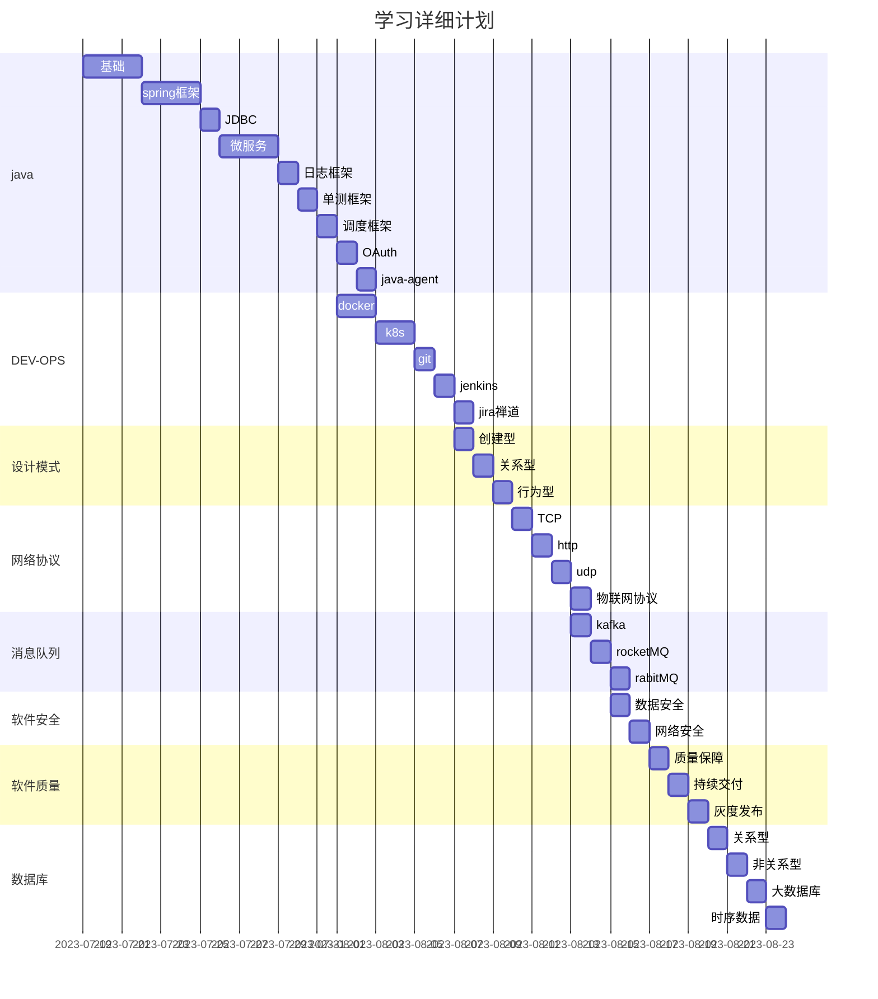

## 时间计划 TODO

```mermaid
gantt
		  title 学习概要计划
		  dateFormat  YYYY-MM-DD
      section 学习计划
	      java           :a1, 2023-07-19, 10d
	      DEV-OPS        :a2, after a1  , 7d
	      设计模式        :a3, after a2 , 3d
	      网络协议        :a4, after a3, 3d
	      消息队列        :a5, after a4, 3d
	      软件安全        :a6, after a5, 3d
	      软件质量        :a7, after a6, 3d
		    数据库          :a8, after a7, 3d
      	算法            :a9, after a8, 3d
        业务能力         : 3d
      section 工作相关
      	工作总结         :2023-07-19  , 2d
      	简历优化         : 2d
        简历投递         : 2023-08-01, 1d
      
```

```mermaid
gantt
		  title 学习详细计划
		  dateFormat  YYYY-MM-DD
      section java
	      基础           :a1, 2023-07-19, 3d
	      spring框架     :a2, after a1  , 3d
	      JDBC          :a3, after a2 , 1d
	      微服务         :a4, after a3, 3d
	      日志框架       :a5, after a4, 1d
	      单测框架       :a6, after a5, 1d
	      调度框架       :a7, after a6, 1d
		    OAuth         :a8, after a7, 1d
      	java-agent    :a9, after a8, 1d
      section DEV-OPS
      	docker      :2023-08-01  , 2d
      	k8s         : 2d
        git         : 1d
        jenkins     : 1d
        jira禅道     :1d
      section 设计模式
        创建型       : 2023-08-07, 1d
        关系型       : 1d
        行为型       : 1d
      section 网络协议
        TCP         : 2023-08-10, 1d
				http        : 1d
        udp         : 1d
        物联网协议    : 1d
      section 消息队列
				kafka       :2023-08-13, 1d
        rocketMQ    : 1d
        rabitMQ     : 1d
			section 软件安全
				数据安全     : 2023-08-15, 1d
        网络安全     : 1d
			section 软件质量
				质量保障     : 2023-08-17 , 1d
        持续交付     : 1d
				灰度发布     : 1d
			section 数据库
				关系型       : 2023-08-20, 1d
				非关系型     : 1d
				大数据库     : 1d
				时序数据     : 1d
			section 算法
			section 业务能力
      
```
